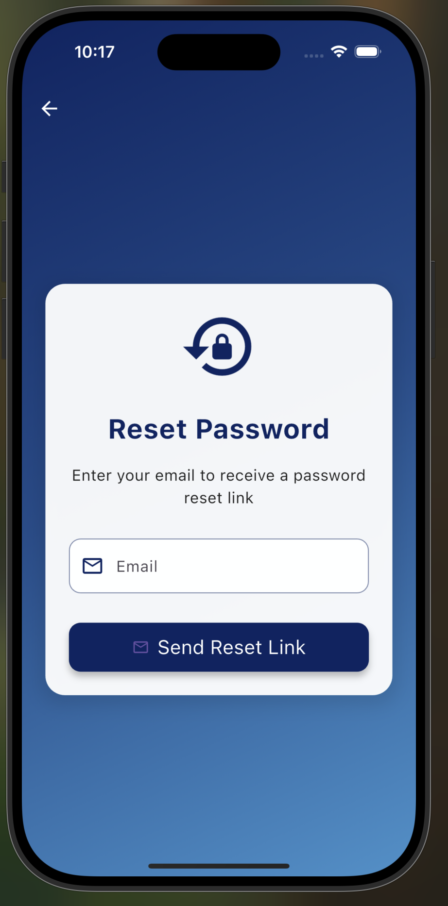

# ConnectPro - Real-time Chat Application

ConnectPro is a modern real-time chat application built with Flutter and Firebase, featuring a clean UI and essential messaging capabilities.

## 🌟 Current Features

## 📱 Authentication Flow Screenshots

### Sign Up Process

#### Step 1: Profile Picture

- Profile picture selection
- Camera or gallery upload
- Preview and crop functionality

#### Step 2: Personal Information

- Name input
- Email validation
- Clean form design
- Real-time validation

#### Step 3: Security

- Password creation
- Password strength indicator
- Password confirmation
- Secure input fields

### Email Verification

- Email verification screen
- Resend email option
- Countdown timer
- Auto-verification check

### Current Implementation Details

#### Sign Up Features

### Messaging
- Real-time Text Messages
- Image Sharing
- Message Status (Sent/Delivered)
- Message Timestamps
- Online/Offline Status

### User Experience
- User Search
- User Profile View
- Last Active Status
- Message Notifications
- Clean, Modern UI

## 🚀 Planned Features

### Authentication & Security
- [ ] Google/Apple Sign In
- [ ] Two-Factor Authentication
- [ ] Biometric Login
- [ ] Password Reset
- [ ] Account Deletion

### Messaging Enhancements
- [ ] Voice Messages
- [ ] Video Messages
- [ ] File Sharing
- [ ] Message Reactions
- [ ] Message Reply/Thread
- [ ] Message Edit/Delete
- [ ] Message Search
- [ ] Read Receipts
- [ ] Typing Indicators

### Groups & Channels
- [ ] Group Chat Creation
- [ ] Channel Management
- [ ] Admin Controls
- [ ] Member Roles
- [ ] Group Media Sharing

### UI/UX Improvements
- [ ] Dark Mode
- [ ] Custom Themes
- [ ] Message Animations
- [ ] Chat Wallpapers
- [ ] Chat Backup
- [ ] Chat Archive

### Additional Features
- [ ] Video Calls
- [ ] Voice Calls
- [ ] Status/Stories
- [ ] Contact Sync
- [ ] Message Translation
- [ ] Scheduled Messages
- [ ] Polls/Surveys

## 📱 Screenshots

### Authentication Flow

- Simple login flow
- simple and consistent UI
- Account verification

### Chat Interface

- Clean message bubbles
- Time stamps
- Online status indicators

### User Management

- Reset link
- Email notification
- Real time

## 🛠 Technical Implementation

### Firebase Services Used
- Authentication
- Firestore
- Storage
- Cloud Messaging

